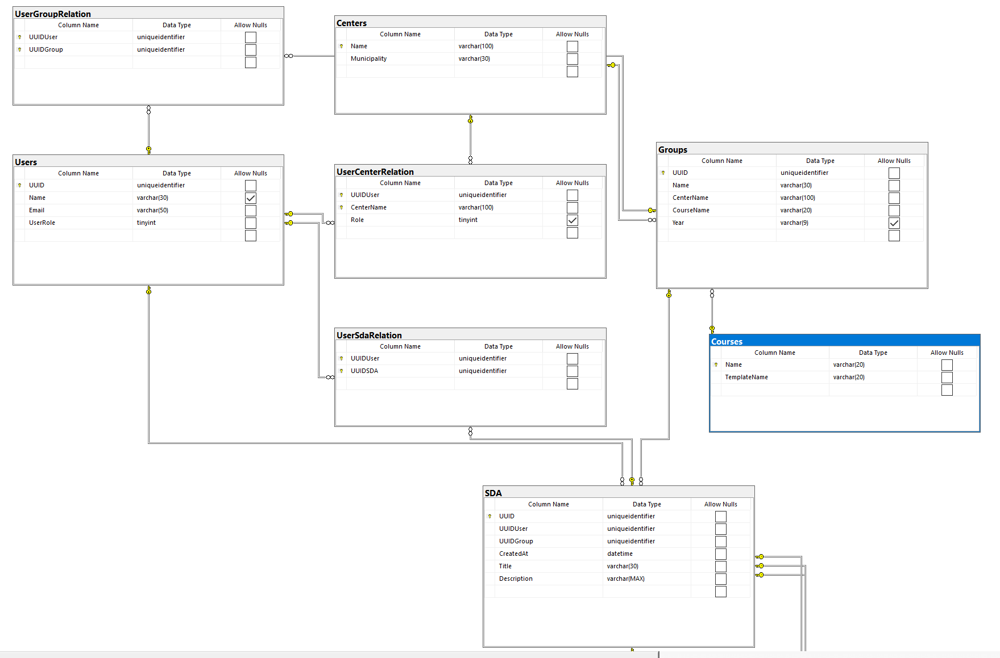
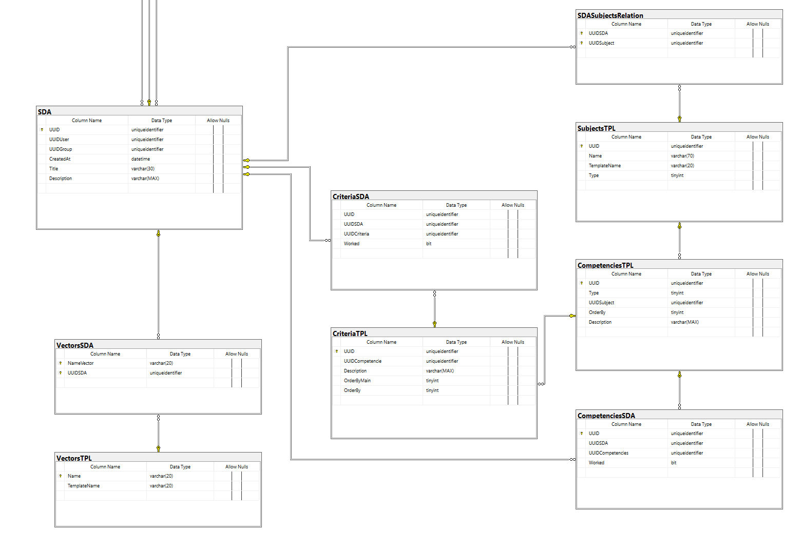

# RegistreCurricularProjecteFinal
//Nomenclatures al importar els CSV per la plantilla:
//Type: Fa referencia a el tipus de competencia de les MATERIES, pot ser Especifiques (1) o Transversals (0)
//Competencie: Fa referencia al tipus de les COMPETENCIES, pot ser Competencia (1) o Saber (0) 

//Nomenclatures dels rols de usuari:
//UserRole: User (1) Administratrçor (2)
//Role "UserCenterRelation" Professor (1) AdminCenter(2)


# Registre Curricular Projecte Final

## Passos d'inicialització

### 1. Clonar projecte

Executeu la comanda:

```bash
git clone https://github.com/NilCastilla262/RegistreCurricularProjecteFinal.git
```

### 2. Configurar Docker i Microsoft SQL Server

1. Instal·leu Docker al vostre sistema operatiu.
2. Aneu a la carpeta `docker/scripts` del projecte.
3. Executeu `createDocker.sh` (Linux/macOS) o `createDocker.bat` (Windows).
4. Instal·leu Microsoft SQL Server Management Studio des de [aquesta pàgina](https://learn.microsoft.com/es-es/ssms/download-sql-server-management-studio-ssms#download-ssms).
5. Un cop instal·lat, connecteu-vos a la base de dades.
6. Executeu l'script corresponent dins de `docker/scripts` amb l'eina `mssql` en cadascun dels dos servidors SQL (cada servidor té el seu propi script).

### 3. Configurar autenticació amb Google

1. Entrau a [Google Cloud Console](https://console.cloud.google.com/).
2. Creeu un nou projecte.
3. Aneu a **APIs & Services > OAuth consent screen**, empleneu els camps i deseu.
4. Aneu a **APIs & Services > Credentials > Create Credentials > OAuth client ID**.

   * Tipus d'aplicació: **Web application**
   * Orígens JavaScript autoritzats: `http://localhost:4200` (o el port del vostre frontend)
5. Apunteu el **Client ID** i el **Client Secret**.

## Configuració del Backend

A la carpeta `Backend`, creeu dos fitxers:

* `.env`
* `dev.env`

Amb la següent estructura:

```dotenv
DB_SERVER=localhost                # IP del servidor SQL
DB_DATABASE=RegistreCurricular     # Nom de la base de dades
DB_USER=sa                         # Usuari de la BD
DB_PASSWORD=Patata1234             # Contrasenya de la BD
DB_PORT=1533                       # Port de connexió
DB_ENCRYPT=true                    # Encriptació (true/false)
DB_TRUST_SERVER_CERTIFICATE=true   # Confiar en certificat (true/false)

JWT_SECRET=laTevaClauSecreta       # Clau secreta per a JWT
JWT_EXPIRATION=1h                  # Temps d'expiració del JWT

GOOGLE_CLIENT_ID=SEU_CLIENT_ID
GOOGLE_CLIENT_SECRET=SEU_CLIENT_SECRET
```

## Instal·lació de dependències

### Backend

```bash
cd Backend
npm install
```

### Frontend

```bash
cd Frontend/RegistreCurricular
npm install
```

## Iniciar l'aplicació

### Frontend

```bash
cd Frontend/RegistreCurricular
npm start
```

### Backend

* En producció:

  ```bash
  cd Backend
  npm start
  ```
* En desenvolupament (hot reloading):

  ```bash
  cd Backend
  npm run dev
  ```

## API Endpoints

**Base URL**: `/apirc/v1`

### Auth

* `POST  /auth/google-login`                : Login amb Google
* `POST  /auth/choose-center`               : Escollir centre inicial
* `GET   /auth/my-centers`                   : Obtenir centres de l'usuari
* `POST  /auth/choose-center-protected`     : Canviar centre amb token

### CSV

* `POST  /upload-csv`                        : Pujar un CSV amb part de la plantilla

### Groups

* `GET    /groups/`                          : Obtenir groups d'un usuari
* `GET    /groups/resume`                    : Generar resum a través de groups
* `GET    /groups/center`                    : Obtenir groups d'un centre
* `POST   /groups/`                          : Crear un group
* `PUT    /groups/:uuid`                     : Actualitzar nom d'un group
* `DELETE /groups/:uuid`                     : Eliminar un group

### Subjects

* `GET /subjects`                            : Obtenir matèries

### SDA

* `POST /sda/`                               : Crear una SDA
* `GET  /sda/`                               : Obtenir SDA paginades i ordenades
* `POST /sda/markCriteria`                   : Marcar/desmarcar criteris

### Courses

* `GET /courses/:courseName/template`        : Obtenir plantilla d'un curs

### SDA-Subject Relation

* `POST /sda/subject-relation`               : Crear relació entre matèria i SDA

### Fill SDA

* `POST /sda/fillSDA`                       : Emplenament de la SDA utilitzant la plantilla

### Full SDA

* `GET /sda/full/:uuid`                     : Obtenir tota la SDA

### User-Center Relations

* `POST   /user-center-relations`            : Crear relació usuari-centre
* `PUT    /user-center-relations`             : Actualitzar rol d'un usuari al centre
* `DELETE /user-center-relations/:UserEmail`  : Eliminar un usuari del centre

### Users

* `GET /users/center`                        : Obtenir usuaris d'un centre

### User-Group Relations

* `GET    /user-group-relations/user/:uuid`  : Grups d'un usuari
* `GET    /user-group-relations/group/:uuid` : Usuaris d'un grup
* `POST   /user-group-relations`              : Crear relació usuari-grup
* `DELETE /user-group-relations/:userUUID/:groupUUID` : Eliminar relació

## Errors

| Codi | Descripció                                       |
| ---- | ------------------------------------------------ |
| 400  | Error del client (petició malformada)            |
| 401  | No autoritzat                                    |
| 403  | Prohibit                                         |
| 404  | No trobat                                        |
| 409  | Conflict (ja existeix la relació)                |
| 422  | Dades invalides                                  |
| 500  | Error intern del servidor                        |
| 503  | Servei no disponible (ex. base de dades caiguda) |

## Llibreries utilitzades al Backend

### Dependencies

* **bcrypt**: Xifrat de contrasenyes
* **cors**: Gestió de CORS
* **csv-parser**: Processament de fitxers CSV
* **dotenv**: Carregar variables d'entorn
* **express**: Crear servidor web
* **express-rate-limit**: Limitació de peticions
* **fs**: Accés al sistema de fitxers
* **google-auth-library**: Autenticació OAuth amb Google
* **js-yaml**: Parseig de YAML
* **mssql**: Connexió amb SQL Server
* **multer**: Puja de fitxers
* **passport**: Autenticació
* **passport-google-oauth20**: OAuth2 amb Google
* **resolve**: Resolució de mòduls
* **swagger-ui-express**: Servei de documentació Swagger UI
* **winston**: Logging
* **winston-daily-rotate-file**: Rotació diària de logs

### DevDependencies

* **cross-env**: Variables d'entorn multiplataforma
* **nodemon**: Reinici automàtic al detectar canvis
* **swagger-autogen**: Autogeneració de docs Swagger

## Rutes Frontend

1. `/login`         : Login amb Google
2. `/dashboard`     : Dashboard principal
3. `/create-sda`    : Crear una nova SDA
4. `/list-sda`      : Llistar SDA
5. `/show-sda/:uuid`: Mostrar detall d'una SDA
6. `/create-resume` : Generar resum a partir d'un grup
7. `/change-center` : Canviar de centre
8. `/manage-teachers`         : Gestionar professors del centre (Admin)
9. `/manage-groups`           : Gestionar grups del centre (Admin)
   10.`/manage-user-groups/:uuid`: Gestionar grups d'un usuari (Admin)

## Model Entitat-Relació (E-R)



